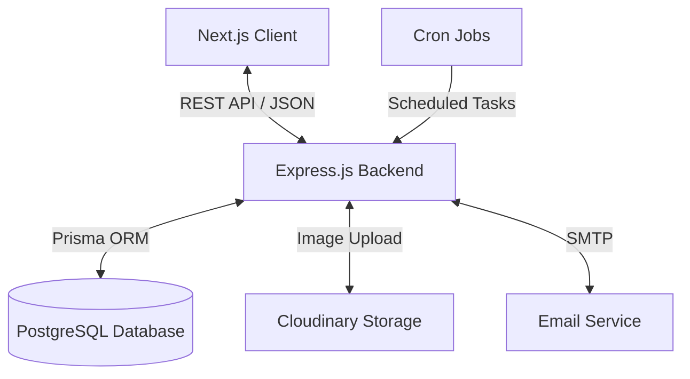
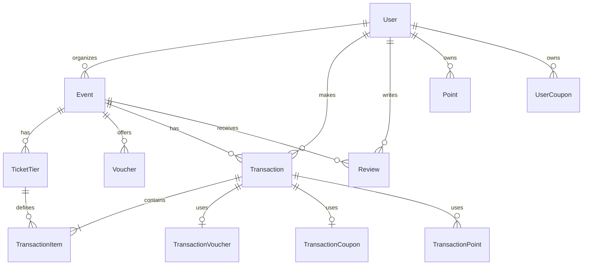
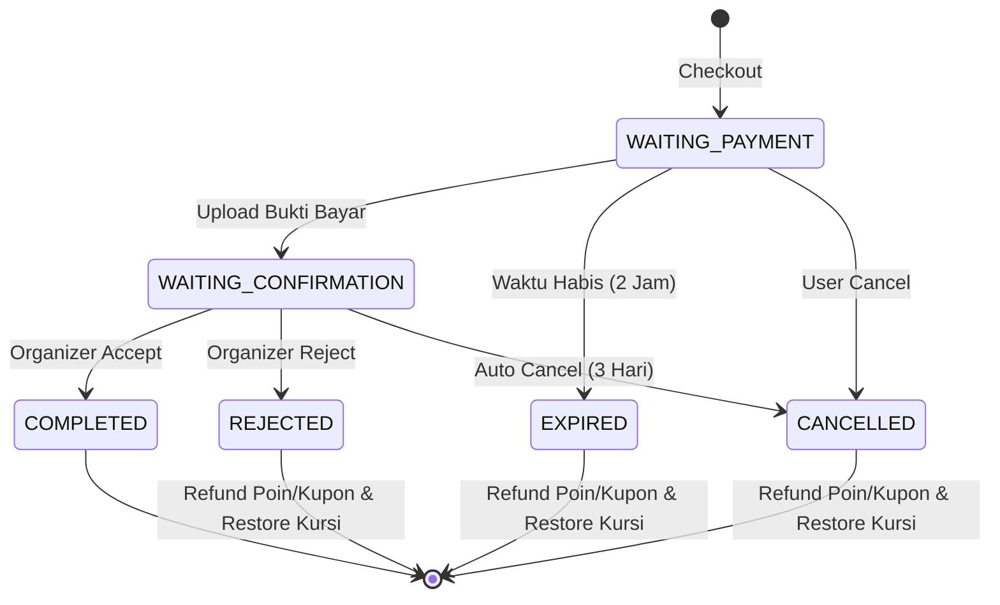
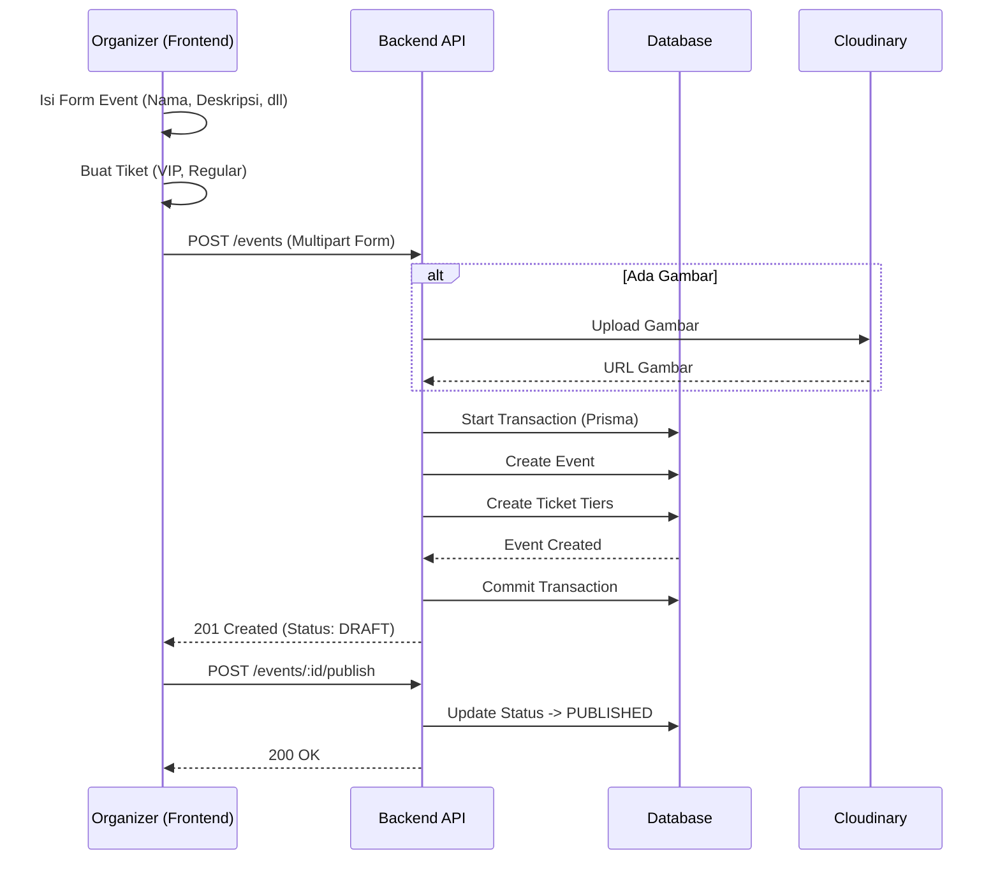

## 1. Arsitektur Sistem (System Architecture)

Aplikasi ini menggunakan arsitektur Monolith (Modular) untuk Backend dan Client-Server untuk Frontend.

**Komponen Utama:**

- **Frontend:** Next.js 14 (App Router), Tailwind CSS, Zustand, React Query.
- **Backend:** Node.js, Express, Prisma ORM.
- **Database:** PostgreSQL (Relational Data).
- **Storage:** Cloudinary (untuk gambar event & bukti bayar).
- **Scheduler:** Node-cron (untuk expire transaksi & poin otomatis).

---

## 2. Struktur Database (ERD - Entity Relationship Diagram)

Berikut adalah relasi antar tabel utama dalam database:

---

## 3. Alur Transaksi (Transaction Lifecycle)

Logika paling kompleks di aplikasi ini adalah siklus hidup transaksi tiket.

**Status Transaksi:**

1. `WAITING_PAYMENT`: User checkout, belum upload bukti.
2. `WAITING_CONFIRMATION`: User sudah upload bukti, Organizer belum konfirmasi.
3. `COMPLETED`: Organizer menerima (Accept).
4. `REJECTED`: Organizer menolak (Reject) -> Refund terjadi.
5. `EXPIRED`: User telat bayar (2 jam) -> Refund terjadi.
6. `CANCELLED`: User membatalkan / Organizer tidak respon (3 hari) -> Refund terjadi.

**Diagram State Machine:**

---

## 4. Logika Bisnis Utama (Key Business Logic)

### A. Sistem Poin & Referral

Mekanisme ini berjalan saat registrasi pengguna baru.

1. **User A** membagikan kode referral (`REF-USERA`).
2. **User B** mendaftar memasukkan kode `REF-USERA`.
3. **Sistem:**
    - Validasi kode referral.
    - Create User B.
    - **User A (Referrer)**: Mendapat +10.000 Poin (Masa berlaku 3 bulan).
    - **User B (Referred)**: Mendapat Kupon Diskon 10% (Masa berlaku 3 bulan).

### B. Penggunaan Poin (FIFO - First In First Out)

Saat user menggunakan poin untuk diskon transaksi, sistem menggunakan logika FIFO untuk memotong saldo poin yang akan kedaluwarsa lebih dulu.

- *Contoh:* User punya 5.000 (Exp: Jan) dan 10.000 (Exp: Feb).
- User pakai 7.000 poin.
- *Sistem:* Ambil 5.000 dari bucket Jan, dan 2.000 dari bucket Feb.

### C. Pembatalan & Refund (Refund Logic)

Jika transaksi `CANCELLED`, `REJECTED`, atau `EXPIRED`:

1. **Kursi (Seat):** Dikembalikan ke kuota tiket (`soldCount - qty`).
2. **Poin:** Jika user pakai poin, poin dibuatkan record baru dengan *expiry date* baru (3 bulan dari tanggal refund).
3. **Kupon/Voucher:** Status kupon dikembalikan menjadi aktif (`isUsed = false`) dan kuota voucher dikembalikan.

---

## 5. Alur Pembuatan Event (Organizer Flow)

---

## 6. Scheduled Jobs (Cron Jobs)

Server menjalankan tugas otomatis di latar belakang:

| Frekuensi | Nama Job | Fungsi |
| --- | --- | --- |
| **5 Menit** | `expireTransactions` | Mengecek transaksi `WAITING_PAYMENT` yang melewati batas waktu 2 jam. Mengubah status ke `EXPIRED` & Refund resource. |
| **1 Jam** | `autoCancelTransactions` | Mengecek transaksi `WAITING_CONFIRMATION` yang didiamkan Organizer > 3 hari. Mengubah status ke `CANCELLED`. |
| **Harian (00:00)** | `expirePoints` | Menandai poin yang masa berlakunya habis sebagai `isUsed=true`. |
| **Harian (00:00)** | `expireCoupons` | Menandai kupon yang masa berlakunya habis. |

---

## 7. Validasi & Keamanan

- **JWT Auth:** Token disimpan di memory (client) dan refresh token di HTTPOnly Cookie/Database untuk keamanan sesi.
- **Role Based:** Middleware (`authorize('ORGANIZER')`) memastikan user biasa tidak bisa mengakses dashboard organizer.
- **Zod Validation:** Semua input dari frontend divalidasi ketat di backend sebelum menyentuh database (mencegah data korup/injeksi).
- **Rate Limiting:** Mencegah brute force pada endpoint login dan register.
